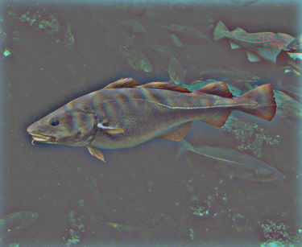

# Your Name <span style="color:red">(your cs id)</span>
賴怡惠 103011105
# Project 1 / Image Filtering and Hybrid Images

## Overview
The project is related to 
1. implement my_filter.py to do onvolution
2. understand the mechanism of realizing "hybrid" images: high and low frequencies of images
3. get familiar to utilize Numpy which helps simplify my code and make it more readable
4. read instructions concerning the specification which there are many details hidden in

## Implementation
1. proj1.py
	* follow the steps in the comment:
	> Remove the high frequencies from image1 by blurring it. The amount of blur that works best will vary with different image pairs
	```
		low_frequencies = my_imfilter(image1, gaussian_filter)
	```
	> remove the low frequencies from image2. The easiest way to do this is to subtract a blurred version of image2 from the original version of image2. This will give you an image centered at zero with negative values.
	```
		high_frequencies = image2 - my_imfilter(image2, gaussian_filter)
	```
	> Combine the high frequencies and low frequencies
	```
		hybrid_image = low_frequencies+high_frequencies
	```
	* most tricky and easily forget:
	> use normalize function which has provided by TA in ../code
	```
		plt.imshow(normalize(low_frequencies))
		plt.imshow(normalize(high_frequencies+0.5))
		plt.imshow(normalize(vis))
		plt.imsave(main_path+'/results/low_frequencies_mouse_bear.png', normalize(low_frequencies), 'quality', 95)
		plt.imsave(main_path+'/results/high_frequencies_mouse_bear.png', normalize(high_frequencies+0.5), 'quality', 95)
		plt.imsave(main_path+'/results/hybrid_image_mouse_bear.png', normalize(hybrid_image), 'quality', 95)
		plt.imsave(main_path+'/results/hybrid_image_scales_mouse_bear.png', normalize(vis), 'quality', 95)
	```
	> if I don't use the function before showing or saving images, there is some flow on the image
	
2. my_filter.py
	* Get the size (length、width) of the image and filter first:
	> I use "shape" supported by numpy to get these information
	```
		im_dim=image.shape
    	flt_dim=imfilter.shape
    	img_dim1=im_dim[0]
    	img_dim2=im_dim[1]
    	flt_dim1=flt_dim[0]
    	flt_dim2=flt_dim[1]
	```
	* Deside the added amount of length and width ofpadding array befor convolution in order to deal with the edge problem:
	> The added amount of length and width is according to the filter's size.
	> First, I imagine that the way how the filter moves to do convolution with image.
	> Therefore, I pad half of the filter length to the upper and lower side 
	> and half of the filter width to the left and right side respectively. 
	```
		pad_dim1=int((flt_dim1-1)/2)
		pad_dim2=int((flt_dim2-1)/2)
	```
	* Initialize the padding array to be zeros:
	> zeros function is supported by numpy
	```
		pad_mat=np.zeros((img_dim1+2*pad_dim1,img_dim2+2*pad_dim2,3))
	```
	* Assign the image pixels to the center of padding array:
	> I padded half of the filter length to the upper and lower and side half of the filter width to the left and right side respectively, so the actual position of image is staring from pad_dim1 and img_dim2 and ending with these plus the size of actual image
	```
		pad_mat[pad_dim1: img_dim1 + pad_dim1, pad_dim2: img_dim2 + pad_dim2] = image
	```
	* Do convolution:
	> Fiter is moving from the most upper left pixel and to the most lower-right pixel in the "actual image region." At each time, the filter pad it self on the padded image and the corresponded pixels multiple each other and then sum them up.
	```
		for d in range(len(image[0][0])):
			for i in range(len(image)):
			    for j in range(len(image[0])):
				output[i][j][d] = sum(sum(np.multiply(imfilter,pad_mat[i:i+flt_dim1,j:j+flt_dim2,d])))
	```
## Installation
* Other required packages.
import numpy as np in my_filter.py
* How to compile from source?
open a terminal in the folder homework1 and type "python proj1.py" in the command line 

### Results

<table border=1>
<col width="25%">
<col width="25%">
<col width="25%">
<col width="25%">
<tr>
    <th>low frequencies</th>
    <th>high frequencies</th> 
    <th>hybrid image</th>
    <th>hybrid image scales</th>
</tr>
<tr>
<td>

</td>
<td>

</td>
<td>

</td>
<td>

</td>
</tr>

<tr>
<td>

</td>
<td>

</td>
<td>

</td>
<td>

</td>
</tr>

<tr>
<td>

</td>
<td>

</td>
<td>

</td>
<td>

</td>
</tr>

<tr>
<td>

</td>
<td>

</td>
<td>

</td>
<td>

</td>
</tr>

<tr>
<td>

</td>
<td>

</td>
<td>

</td>
<td>

</td>
</tr>
</table>
