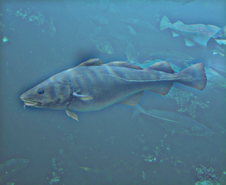

# Your Name <span style="color:red">(yout cs id)</span>
賴怡惠 103011105
# Project 1 / Image Filtering and Hybrid Images

## Overview
The project is related to 
> The main idea of implementing my_filter.py is doing convolution for each pixel.
> Numpy provides many useful compuational functions which helps simplify my code and make it more readable.  

## Implementation
1. One
	* item
	* item
2. Two

```
Code highlights
```

## Installation
* Other required packages.
<p>
&nbsp&nbspimport numpy as np in my_filter.py<br/>
</p>
* How to compile from source?
<p>
&nbsp&nbspopen a terminal in the folder homework1 and type "python proj1.py" in the command line <br/>
</p>
### Results

<table border=1>
<col width="25%">
<col width="25%">
<col width="25%">
<col width="25%">
<tr>
    <th>low frequencies</th>
    <th>high frequencies</th> 
    <th>hybrid image</th>
    <th>hybrid image scales</th>
</tr>
<tr>
<td>

</td>
<td>

</td>
<td>

</td>
<td>

</td>
</tr>

<tr>
<td>

</td>
<td>

</td>
<td>

</td>
<td>

</td>
</tr>

<tr>
<td>

</td>
<td>

</td>
<td>

</td>
<td>

</td>
</tr>

<tr>
<td>

</td>
<td>

</td>
<td>

</td>
<td>

</td>
</tr>

<tr>
<td>

</td>
<td>

</td>
<td>

</td>
<td>

</td>
</tr>
</table>
